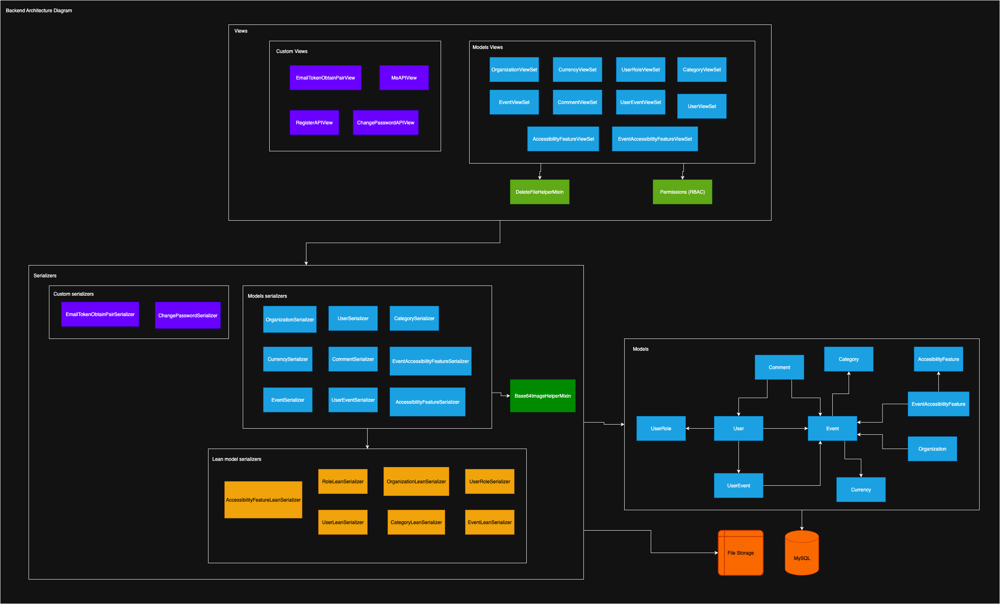

## **Public Description**
Agenda Cultural Costa Rica is an open-source (MIT licensed) web platform for municipalities, NGOs, and organizations to promote and manage cultural events nationwide. It centralizes event information with a focus on accessibility, allowing democratic publishing and public access through a reusable REST API.

Developed as part of the **Software Design course** at CENFOTEC, it applies best practices in full-stack development, system architecture, and accessibility (WCAG 2.1 AA). Users can publish, discover, bookmark, comment on, and rate events.

## Objectives
- Unify scattered cultural event information into a single accessible platform.
- Provide detailed accessibility metadata for each event to support inclusive participation.
- Enable democratic publishing of events by municipalities, NGOs, and organizations.
- Offer a public, open REST API for reuse by external applications and services.

## Tech Stack
- **Frontend**: React 19.1.0
- **Backend**: Django 4.2.14 + Django REST Framework 3.16.0
- **Database**: MySQL 9.3.0

## Features
- Public event listings with filters
- Accessibility metadata per event
- User authentication and role-based permissions
- Personalized "User Events" section
- Event comments and rating system
- Admin interface for managing users and content

## MVP Use Cases
- As a visitor, I want to browse cultural events by category and location.
- As an organizer, I want to publish new cultural events with detailed accessibility information.
- As a registered user, I want to bookmark events to create my personal agenda.
- As a visitor, I want to filter events based on accessibility features.
- As an organizer, I want to manage and update the events I have published.
- As a registered user, I want to comment on and rate events I have attended.

## Is / Is Not

- **Is:**
  - A centralized cultural event catalog.
  - Accessibility-first by design.
  - A platform for democratic event publishing.
  - An open REST API for reuse by municipalities and NGOs.

- **Is Not:**
  - A ticketing or payment platform.
  - A social media network.
  - A proprietary closed system.
  - A replacement for official government websites.

## User Roles Overview

| Role          | Allowed Actions                                                                                     |
|---------------|---------------------------------------------------------------------------------------------------|
| Administrator | Manage users, organizations, categories, accessibility features, and all event content.            |
| Visitor       | Browse public events, view event details, and read comments and ratings without authentication.   |
| Organizer     | Publish, update, and manage their own events, including adding accessibility metadata and comments.|

## Backend API

The backend API is built with **Django REST Framework** and provides the following endpoints:

### Endpoints & Methods

| Resource                      | Endpoint (Prefix)                  | GET   | POST  | PUT   | PATCH | DELETE |
|-------------------------------|------------------------------------|-------|-------|-------|-------|--------|
| Currency                      | `api/currencies/`                     | ✔️    | ✔️    | ✔️    | ✔️    | ✔️     |
| User Role                     | `api/userroles/`                      | ✔️    | ❌    | ❌    | ❌    | ❌     |
| Organization                  | `api/organizations/`                  | ✔️    | ✔️    | ✔️    | ✔️    | ✔️     |
| User                          | `api/users/`                          | ✔️    | ❌    | ✔️    | ✔️    | ✔️     |
| Category                      | `api/categories/`                     | ✔️    | ✔️    | ✔️    | ✔️    | ✔️     |
| Event                         | `api/events/`                         | ✔️    | ✔️    | ✔️    | ✔️    | ✔️     |
| UserEvent (My Agenda)         | `api/userevents/`                     | ✔️    | ✔️    | ✔️    | ✔️    | ✔️     |
| Accessibility Feature         | `api/accessibilityfeatures/`          | ✔️    | ✔️    | ✔️    | ✔️    | ✔️     |
| EventAccessibilityFeature     | `api/eventaccessibilityfeatures/`     | ✔️    | ✔️    | ✔️    | ✔️    | ✔️     |
| Comment                       | `api/comments/`                       | ✔️    | ✔️    | ✔️    | ✔️    | ✔️     |

**Authentication/User Endpoints:**

| Endpoint              | Methods   | Description                      |
|-----------------------|-----------|----------------------------------|
| `/login/`             | POST      | Obtain access & refresh token    |
| `/refresh/`           | POST      | Refresh access token             |
| `/register/`          | POST      | User registration                |
| `/logout/`            | POST      | Blacklist refresh token          |
| `/me/`                | GET       | Current user info (JWT required) |
| `/change-password/`   | POST      | Change current user password     |
| `/api/password-reset/` | POST      | Request password reset email     |
| `/api/password-reset/confirm/` | POST | Confirm password reset token     |

### Available Filters

| Resource                    | Filters (query params)                                   |
|-----------------------------|---------------------------------------------------------|
| Currency                    | `id`, `name`                                                  |
| Organization                | `id`, `email`                                                 |
| User                        | `id`, `email`, `name`, `role`, `organization`                 |
| Event                       | `id`, `category`, `created_by`, `approved_by`, `is_event_approved`, `is_event_active` |
| UserEvent (My Agenda)       | `id`, `user`, `event`                                         |
| EventAccessibilityFeature   | `id`, `event`, `accessibility_feature`                        |
| Comment                     | `id`, `event`, `user`                                         |

You can use filters as query parameters, e.g. `/events/?category=2&is_event_approved=true`

### Permissions Matrix

| Resource                      | GET            | POST           | PUT/PATCH        | DELETE           |
|-------------------------------|----------------|----------------|------------------|------------------|
| **Currency**                  | Authenticated  | Admin          | Admin            | Admin            |
| **UserRole**                  | Public         | -              | -                | -                |
| **Organization**              | Authenticated  | Authenticated  | Admin/Creator    | Admin/Creator    |
| **User**                      | Creator/Admin  | -              | Creator/Admin    | Creator/Admin    |
| **Category**                  | Public         | Admin          | Admin            | Admin            |
| **Event**                     | Public         | Authenticated  | Admin/Creator    | Admin/Creator    |
| **UserEvent** (My Agenda)     | Creator/Admin  | Authenticated  | Creator/Admin    | Creator/Admin    |
| **AccessibilityFeature**      | Admin          | Admin          | Admin            | Admin            |
| **EventAccessibilityFeature** | Admin/Creator  | Admin/Creator  | Admin/Creator    | Admin/Creator    |
| **Comment**                   | Public         | Authenticated  | Creator          | Admin/Creator    |

- **Admin**: User with “Administrator” role.
- **Creator**: The user who created the object.
- **Authenticated**: Any logged-in user.
- **Public**: No authentication required.
- “-”: Not available.

**Note:**  
- All endpoints (except `/login/`, `/register/`, `/refresh/`) require JWT authentication unless marked as "Public".
- Some write/delete actions require admin or object creator privileges.

## Architecture Diagram

Below is the high-level system architecture for Agenda Cultural Costa Rica:



## Development Setup (Automatic)

### 1. Clone the repository
```bash
git clone https://github.com/your-username/AgendaCulturalCostaRica.git
cd AgendaCulturalCostaRica
````

### 2. Run the setup script

This command will:

* Delete and create again the MySQL database
* Set up a Python virtual environment
* Install backend dependencies
* Apply Django migrations
* Start the Django development server

> **Note:** The setup scripts work on both Linux and macOS.

> Replace `mysqlpassword` with your actual MySQL root password.

```bash
./setup.sh mysqlpassword
```

Once complete, the API will be available at [http://localhost:8000](http://localhost:8000).

There are two options:
- [http://localhost:8000/api](http://localhost:8000/api): Django REST API
- [http://localhost:8000/admin](http://localhost:8000/admin): Django Admin interface

### 3. Load sample data (this includes the roles)
If you want to pre-populate the database with sample data, run:

```bash
cd backend
python3 -m venv venv
source venv/bin/activate
pip install -r requirements.txt
cd scripts
python dev_seed.py mysqlpassword
```

This script will use the Django REST API to create some initial events, venues, and other data to test the application.
**Note**: Make sure the backend server is running before executing this script.

## Backend Configuration (Important)

Make sure the following settings are configured correctly in `backend/agendacultural/settings.py`.

### Database settings

```python
DATABASES = {
    'default': {
        'ENGINE': 'django.db.backends.mysql',
        'NAME': 'agenda_cultural_db',
        'USER': 'root',
        'PASSWORD': 'mysqlpassword',
        'HOST': 'localhost',
        'PORT': '3306',
    }
}
```

### Required `INSTALLED_APPS`

Ensure these apps are listed:

```python
INSTALLED_APPS = [
    'django.contrib.admin',
    'django.contrib.auth',
    'django.contrib.contenttypes',
    'django.contrib.sessions',
    'django.contrib.messages',
    'django.contrib.staticfiles',

    # Third-party
    'rest_framework',
    'django_extensions',

    # Project apps
    'events',
]
```

> `django_extensions` is required for running custom scripts with `manage.py runscript`.

## How to Add New Tables (Models)

To add a new table (model) to the Django backend and expose it through the API, follow these steps:

### 1. Define the model

In the corresponding app folder (e.g., `backend/events/models.py`), create your model:

```python
from django.db import models

class Venue(models.Model):
    name = models.CharField(max_length=100)
    location = models.TextField()
```

### 2. Create a serializer

In `backend/events/serializers.py`, create a serializer for the model:

```python
from rest_framework import serializers
from .models import Venue

class VenueSerializer(serializers.ModelSerializer):
    class Meta:
        model = Venue
        fields = '__all__'
```

### 3. Create a ViewSet

In `events/views.py`, create a view for the model:

```python
from rest_framework import viewsets
from .models import Venue
from .serializers import VenueSerializer

class VenueViewSet(viewsets.ModelViewSet):
    queryset = Venue.objects.all()
    serializer_class = VenueSerializer
```

### 4. Register the ViewSet in `backend/events/urls.py`

Make sure the app has a `urls.py` file (create one if not) and register the view:

```python
from rest_framework.routers import DefaultRouter
from .views import VenueViewSet

router = DefaultRouter()
router.register(r'venues', VenueViewSet)

urlpatterns = router.urls
```

### 5. Register model in the admin interface

In `events/admin.py`:

```python
from django.contrib import admin
from .models import Venue

admin.site.register(Venue)
```

### 6. (Optional)  Include app URLs in the main `urls.py`

In `backend/agendacultural/urls.py`, include the app's routes:

```python
from django.contrib import admin
from django.urls import path, include

urlpatterns = [
    path('admin/', admin.site.urls),
    path('api/', include('events.urls')),  
    # Add new app URLs here
]
```

### 7. Create migrations and apply them

Run the following commands:

```bash
python manage.py makemigrations
python manage.py migrate
```

### 8. (Optional) Seed initial data

If you want to pre-populate your table, update `backend/scripts/load_sample_data.py`:

```python
from events.models import Venue

Venue.objects.get_or_create(name="National Theater", location="San José")
```

Then run:

```bash
python manage.py runscript load_sample_data
```

### 9. Test the endpoint

Visit:
`http://localhost:8000/api/venues/`

You should see the list of records (empty if no data yet).

## Frontend Setup (Manual)

From the `frontend/` folder (React SPA with WCAG 2.1 AA accessibility compliance):

```bash
cd frontend
npm install
npm start
```

The frontend is a Single Page Application (SPA) built with React 19.1.0. It features modular, reusable components and client-side routing to provide a smooth user experience. Users can filter events, paginate through results, and benefit from integrated accessibility features to ensure inclusivity.

The frontend will run at [http://localhost:3000](http://localhost:3000) and interact with the backend API.

## Accessibility

The platform complies with WCAG 2.1 Level AA standards, ensuring accessibility for all users. It includes support for high contrast mode, full keyboard navigation, and the use of alternative text for images and icons to improve usability for people with disabilities.

## Security Overview

The backend uses JWT authentication with access and refresh tokens to securely manage user sessions. Role-based access control enforces permissions according to user roles such as Administrator, Organizer, and Visitor. All endpoints validate permissions to protect data and functionality from unauthorized access.

## Notes

* Make sure you have MySQL installed and running.
* Python version: 3.10 or later is recommended.
* Node.js v18+ is recommended for the frontend.
* Both backend and frontend setup scripts are compatible with Linux and macOS.
* The only OS-specific dependency is the MySQL installation and configuration.
